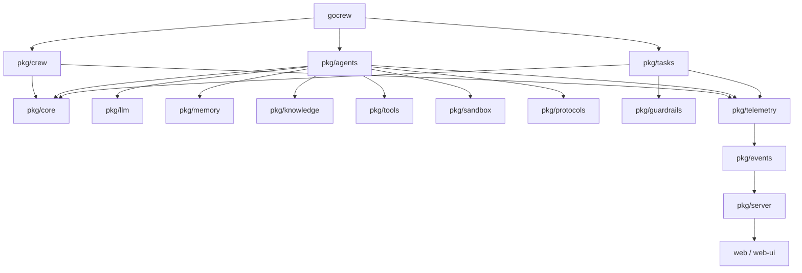
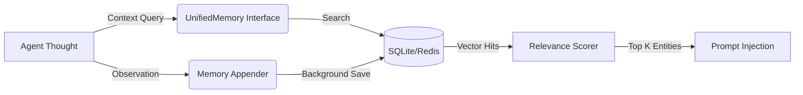
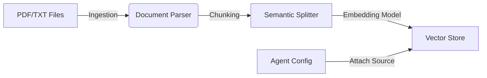

# Architecture

```
Crew-GO/
├── api/proto/            # Protocol buffers for gRPC/REST APIs
├── cmd/
│   ├── gocrew/           # CLI entrypoint
│   └── server/           # HTTP API & Dashboard Server entrypoint
├── gocrew/               # Unified SDK Facade (Recommended for users)
├── pkg/                  # Core Modular Packages
│   ├── agents/           # Agent implementation & reasoning loops
│   ├── core/             # Base interfaces (breaks circular dependencies)
│   ├── crew/             # Orchestration engines (Sequential, Graph, etc.)
│   ├── delegation/       # Agent-to-Agent internal delegation logic
│   ├── events/           # System-wide event structures for WebSockets
│   ├── flows/            # LangGraph-style workflow persistence
│   ├── guardrails/       # Pre/post validation hooks & HITL interrupts
│   ├── knowledge/        # RAG document parsing, chunking & sourcing
│   ├── llm/              # Provider clients (OpenAI, Anthropic, Gemini)
│   ├── memory/           # Vector & entity memory systems
│   ├── protocols/        # MCP and A2A communication layers
│   ├── sandbox/          # Wasm/Docker code execution environments
│   ├── server/           # HTTP Server and Dashboard APIs
│   ├── tasks/            # Task lifecycle & structured output
│   ├── telemetry/        # OpenTelemetry tracing & GlobalBus events
│   ├── tools/            # Tool ecosystem & custom tool patterns
│   └── training/         # Synthetic data pipelines & evaluation
├── internal/             # Private implementation details
├── web/                  # Modern React/Vite Glassmorphic Dashboard
└── web-ui/               # Static/Vanilla UI embeds
```

## Dependency Flow



## Design Principles

1. **Interface-first & Decoupled**: The `pkg/core` package defines the `Agent` interface, allowing `pkg/crew` and `pkg/tasks` to interact with agents without depending on the heavy `pkg/agents` implementation.
2. **Deterministic Orchestration**: Every LLM interaction is parsed into strictly-typed Go structs. 
3. **Reactive Telemetry**: The `GlobalBus` provides a high-fidelity event stream for real-time observability.
4. **Durable Persistence**: LangGraph-style checkpoints allow for "time-travel" debugging and long-running flow resilience.
5. **Polyglot Safety**: Code execution is isolated via Wasm or Docker sandboxes by default.

---

## 🧠 Subsystem Deep Dive: Memory

Gocrewwai's memory model is designed to operate concurrently and deterministically.



The memory subsystem is entirely decoupled from the LLM provider, meaning a model using OpenAI for reasoning can seamlessly query a Redis vector store populated by an open-source Ollama embedding model.

---

## 🛡️ Subsystem Deep Dive: Polyglot Sandboxing

Allowing LLMs to write and execute code is dangerous. The `pkg/sandbox` module acts as a strict execution boundary.

When a `CodeInterpreter` tool is invoked, the request is intercepted by the Sandbox Manager:

1. **WASM (Recommended)**: For lightweight Python/JS execution, Gocrewwai uses a embedded WebAssembly runtime (`wazero`). This provides microsecond startup times with zero filesystem access.
2. **E2B (Cloud)**: For complex environments needing PIP installations, the SDK connects to remote, ephemeral Firecracker microVMs via the E2B SDK.
3. **Docker (Local Enterprise)**: Spins up short-lived containers, binds specific `/tmp` directories, and enforces hard limits (e.g., `--cpus="0.5" --memory="512m"`).

---

## 📚 Subsystem Deep Dive: Knowledge (RAG)

Connecting agents to local or remote documents is handled securely by the `pkg/knowledge` subsystem, avoiding direct memory manipulation by the LLM.



When a Knowledge source is bound to an Agent, the engine automatically intercepts the agent's tasks, queries the Vector Store for relevant chunks, and prepends the findings to the prompt as strict `<context>` blocks. This ensures the agent is grounded in facts *before* generation begins.
