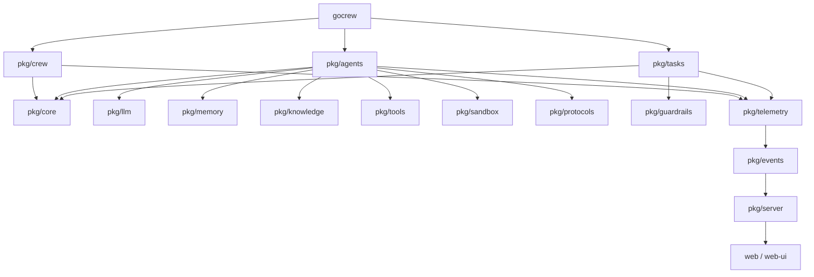
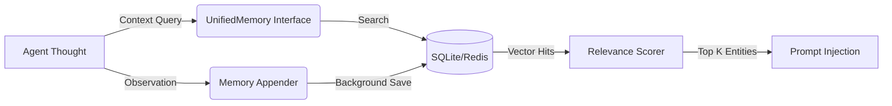
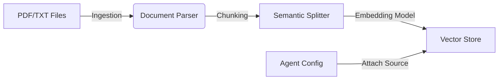

# Architecture

```
gocrewwai/
├── api/proto/           # Protocol buffers
├── benchmarks/          # Benchmarks
├── cmd/
│   ├── gocrew/          # CLI entrypoint
│   └── server/          # HTTP API & dashboard server
├── docs/                # Guides + feature docs
├── examples/            # Example crews and demos
├── gocrew/              # SDK facade (recommended user entrypoint)
├── internal/            # Private impl (cli, delegation, guardrails)
├── pkg/
│   ├── agents/          # Agent definitions & reasoning loops
│   ├── api/mesh/        # Gin REST + gRPC mesh
│   ├── compat/          # Compatibility adapters
│   ├── config/          # YAML/JSON config loading
│   ├── core/            # Base interfaces, primitives
│   ├── crew/            # Orchestration engines
│   ├── dashboard/       # Dashboard APIs
│   ├── delegation/      # A2A internal delegation
│   ├── errors/          # Structured error types
│   ├── events/          # GlobalBus event system
│   ├── files/           # File abstraction
│   ├── flow/            # Workflow persistence (graph nodes/edges)
│   ├── flows/           # Higher-level flow combinators
│   ├── guardrails/      # Pre/post validation + HITL interrupts
│   ├── i18n/            # Internationalization / localization
│   ├── knowledge/       # RAG document parsing, chunking, sourcing
│   ├── llm/             # Provider clients + caching
│   ├── memory/          # Vector + entity memory stores
│   ├── protocols/       # MCP, A2A, WebMCP implementations
│   ├── sandbox/         # Docker + WASM execution isolation
│   ├── server/          # HTTP server, health, metrics
│   ├── tasks/           # Task lifecycle & structured output
│   ├── telemetry/       # OTEL tracing + metrics
│   ├── testing/         # Test harnesses
│   ├── tools/           # Built-in tool ecosystem
│   ├── training/        # HITL training data & pipelines
│   └── utils/           # Shared helpers
├── web/                 # React/Vite dashboard
└── web-ui/              # Static embeddable UI
```

## Dependency Flow


```mermaid
graph TD
    SDK[gocrew] --> pkg/crew
    SDK --> pkg/agents
    SDK --> pkg/tasks

    pkg/crew --> pkg/core
    pkg/agents --> pkg/core
    pkg/tasks --> pkg/core

    pkg/agents --> pkg/llm
    pkg/agents --> pkg/memory
    pkg/agents --> pkg/knowledge
    pkg/agents --> pkg/tools
    pkg/agents --> pkg/sandbox
    pkg/agents --> pkg/protocols

    pkg/tasks --> pkg/guardrails

    pkg/crew --> pkg/telemetry
    pkg/agents --> pkg/telemetry
    pkg/tasks --> pkg/telemetry

    pkg/telemetry --> pkg/events
    pkg/events --> pkg/server
    pkg/server --> WebUI[web / web-ui]
```

## Design Principles

1. **Interface-first & Decoupled**: `pkg/core` defines the `Agent` interface; `pkg/crew` and `pkg/tasks` depend only on that interface, not on `pkg/agents`.
2. **Deterministic Orchestration**: Every LLM interaction is parsed into strictly-typed Go structs.
3. **Reactive Telemetry**: The `GlobalBus` provides a high-fidelity event stream for real-time observability.
4. **Durable Persistence**: LangGraph-style checkpoints allow time-travel debugging and long-running flow resilience.
5. **Polyglot Safety**: Code execution is isolated via WASM or Docker sandboxes by default.

---

## Memory

Gocrewwai's memory model operates concurrently and deterministically.


```mermaid
graph LR
    A[Agent Thought] -->|Context Query| B(UnifiedMemory Interface)
    B -->|Search| C[(SQLite/Redis)]
    C -->|Vector Hits| D[Relevance Scorer]
    D -->|Top K Entities| E[Prompt Injection]
    A -->|Observation| F(Memory Appender)
    F -->|Background Save| C
```

The memory subsystem is entirely decoupled from the LLM provider — a model using OpenAI for reasoning can query a Redis vector store populated by an Ollama embedding model.

---

## Sandboxing

The `pkg/sandbox` module acts as a strict execution boundary for LLM-generated code.

When a `CodeInterpreter` tool is invoked:

1. **WASM (Recommended)**: Embedded WebAssembly runtime (`wazero`). Microsecond startup, zero filesystem access.
2. **E2B (Cloud)**: Remote, ephemeral microVMs via a custom HTTP client against `api.e2b.dev` (E2B-compatible; not the official E2B SDK). Supports PIP installs.
3. **Docker (Local Enterprise)**: Short-lived containers with resource limits (`--cpus="0.5" --memory="512m"`).

---

## Knowledge (RAG)


```mermaid
graph LR
    A[PDF/TXT Files] -->|Ingestion| B(Document Parser)
    B -->|Chunking| C[Semantic Splitter]
    C -->|Embedding Model| D[Vector Store]
    E[Agent Config] -->|Attach Source| D
```

When a Knowledge source is bound to an Agent, the engine intercepts tasks, queries the Vector Store for relevant chunks, and prepends them as `<context>` blocks before generation.